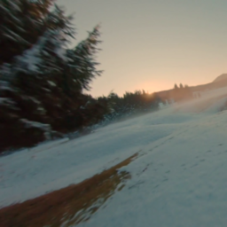
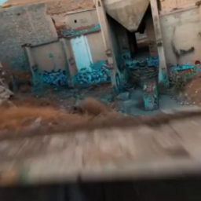

Generative Diffusion Blur Detection

# 环境配置
bash conda_install.sh

conda activate RSGCBD

bash env_install.sh

# 推理
python scripts/blur_inference.py --data_dir /home/agou/vv/ARGCCascade_Test/test1 --out_dir /home/agou/vv/ARGCCascade_Test/haha --model_path /home/agou/vv/ARGCCascade_Test/savedmodel050000.pt  --image_size 256 --num_channels 128 --class_cond False --num_res_blocks 2 --num_heads 1 --learn_sigma True --use_scale_shift_norm False --attention_resolutions 16 --diffusion_steps 1000 --noise_schedule linear --rescale_learned_sigmas False --rescale_timesteps False

### Group 1
- **Media**:
  - 

- **Images**:
  - 
  - 

### Group 2
- **Media**:
  - 

- **Images**:
  - 
  - 

